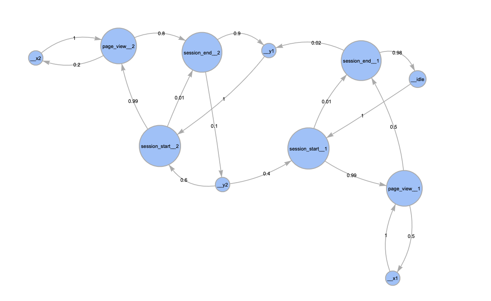

# HealthSyn

This repository contains code for the synthetic data generator or syngen in short. It produces events using a Markov chain simulation, that can be converted to logs for any downstream task - including (but not limited to) conducting reinforcement learning experiments.

A markov chain example is shown in the following image:



Markov chains can be defined using yaml files by following the examples given in `syngen/data/`

## Installing and Deploying

Prepare the conda env for syngen

```bash
# conda update -n base -c defaults conda
# conda deactivate && conda env remove -n syngen

conda create -n syngen "python>=3.10" pip setuptools numpy scipy pyyaml python-dateutil\
  && conda activate syngen \
  && pip install tqdm typing_extensions "black[jupyter]" pydantic
```

And install the package itself

```bash
# developer install
pip install -e .

```

In order to distribute the latest source of syngen package use the following command to get a source archive.

```bash
# make sure to have the latest build stdlib
pip install --upgrade build

# package the syngen as a source distribution into `dist/` as a `.tar.gz` file
python -m build --sdist
```

To generate the json files, run:

```bash
python -m syngen "path where to dump json files" --timestamp="start timestamp in RFC3339 format" --definition="complex_behavior"
```

For example:

```bash
python -m syngen "../jsonFiles" --timestamp="2023-02-01T00:00:00Z" --definition="complex_behavior"
```
